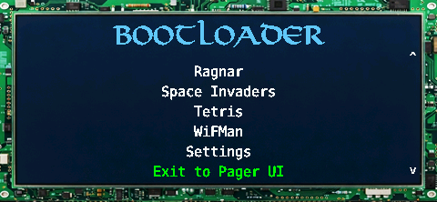
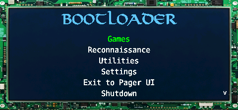
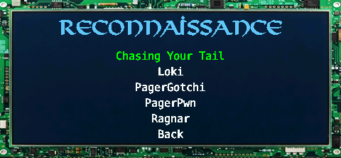
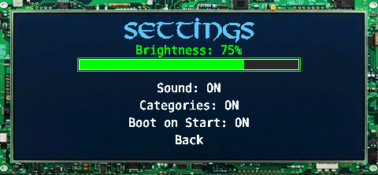

# Pagerctl Bootloader

A boot launcher menu for the WiFi Pineapple Pager. Launch payloads directly using pagerctl — no Pineapple Pager UI required.

<p align="center">
  
  
</p>
<p align="center">
  
  
</p>

The bootloader background automatically matches your active Pineapple Pager UI theme. The screenshots above use the **Circuitry** theme. Here's the same bootloader with the **Wargames** theme:

<p align="center">
  
</p>

You can also set a custom background in `launcher_config.json` to use your own design regardless of the active Pager theme.

## What It Does

The bootloader bypasses the Pineapple Pager UI and launches payloads directly using `libpagerctl.so` for LCD rendering. It can run:

- **On boot** — replaces the Pineapple Pager UI as the default startup screen
- **As a payload** — launch from the Pager UI like any other payload (General > pagerctl_bootloader)

When a payload exits, you're returned to the bootloader menu. Select "Exit to Pager UI" to start the normal Pineapple Pager interface.

## Features

- Auto-discovers installed payloads by scanning `/mmc/root/payloads/user/`
  for directories containing a `pagerctl.sh` (same discovery rule used by
  Pagerctl Home — one unified list of payloads across both menus)
- Shows only payloads that ship a `pagerctl.sh`; classic `payload.sh`-only
  payloads can be opted back in via **Settings > Classic Payloads: ON**
- Category view with toggle (groups payloads by their `/payloads/user/<category>/` directory)
- Scrolling menu with UP/DOWN navigation
- Settings: brightness control, sound toggle, category view, classic-payload visibility, auto-boot target, boot on start
- All settings persist across reboots
- Themeable: custom background, fonts, colors
- Background defaults to the active Pineapple Pager theme
- Sound effects on navigation
- Shutdown and restart options

## Installation

```
git clone https://github.com/pineapple-pager-projects/pineapple_pager_bootloader.git
cd pineapple_pager_bootloader
scp -r pagerctl_bootloader root@172.16.42.1:/root/payloads/user/general/
```

## Controls

| Button | Action |
|--------|--------|
| UP / DOWN | Navigate menu |
| GREEN | Select / confirm |
| RED | Back (in submenus) |
| LEFT / RIGHT | Adjust brightness (in Settings) |

## Boot on Start

Enable in **Settings > Boot on Start: ON** to have the bootloader run automatically when the pager powers on, bypassing the Pineapple Pager UI entirely.

When enabled, the bootloader installs an init script that runs before the Pineapple Pager service. Select "Exit to Pager UI" at any time to start the normal interface.

Disable with **Settings > Boot on Start: OFF** to restore normal boot behavior.

## Auto-Boot a Payload (Pagerctl Home etc.)

The bootloader can launch any installed payload automatically at cold
boot — useful for booting straight into **Pagerctl Home** so the pager
comes up in the custom home screen instead of the bootloader menu.

Enable in **Settings > Auto Boot**. The picker lists "None (disabled)"
plus every installed payload discovered from `scripts/`. Pick the one
you want and save.

On the next cold boot, you'll see a 2-second countdown:

```
Auto Boot
Launching: Pagerctl Home
in 2s...
B = cancel
```

Press **B** during the countdown to skip and drop into the bootloader
menu instead (handy for recovery if something goes wrong). Otherwise
the configured target launches. When the launched payload exits, the
bootloader comes back to the normal menu — auto-boot only fires once
per cold boot, not in a loop.

### Guarantees and safety

- **Only at cold boot.** The init script exports
  `PAGERCTL_BOOTLOADER_MODE=boot`; auto-boot only fires when that env
  var is set. Manual launches from the Pineapple Pager UI always show
  the menu.
- **Target validation.** If the configured target script is missing
  (uninstalled payload, renamed file, etc.) the bootloader shows an
  "Auto-boot target missing" message, clears the setting, and falls
  through to the menu. You won't get stuck.
- **First-run default.** On a fresh install, if `pagerctl_home` is
  already present the auto-boot target defaults to it. Otherwise it
  defaults to off.

### Requires "Boot on Start"

Auto-boot piggybacks on the Boot-on-Start init script, so you need
**Settings > Boot on Start: ON**. If you toggle Boot on Start off and
back on after updating the bootloader, you'll regenerate the init
script (needed the first time after installing the auto-boot feature,
so the script picks up the `PAGERCTL_BOOTLOADER_MODE` env export).

## Adding Payloads

The bootloader scans `/mmc/root/payloads/user/<category>/<payload>/`
for directories containing a `pagerctl.sh`. If your payload ships
one, it shows up in the bootloader menu automatically — no launch
script to maintain.

This matches how Pagerctl Home discovers payloads, so both menus
always show the same list.

### The `pagerctl.sh` contract

`pagerctl.sh` is a short shell script that sets up the environment
and execs the payload's real entry point. The bootloader (or
Pagerctl Home) has already torn the pager down and stopped the
Pineapple Pager service before calling it, so the script doesn't
need to manage that lifecycle — it just runs.

Minimum example:

```sh
#!/bin/sh
# Title: My Payload
# Description: Short one-liner shown on the launch screen
# Author: your_name
# Version: 1.0
# Category: Reconnaissance

PAYLOAD_DIR="/root/payloads/user/reconnaissance/mypayload"

cd "$PAYLOAD_DIR" || exit 1

export PATH="/mmc/usr/bin:$PAYLOAD_DIR/bin:$PATH"
export PYTHONPATH="$PAYLOAD_DIR/lib:$PAYLOAD_DIR:$PYTHONPATH"
export LD_LIBRARY_PATH="/mmc/usr/lib:$PAYLOAD_DIR/lib:$LD_LIBRARY_PATH"

python3 main.py
exit 0
```

### Header metadata

| Tag | Required | Description |
|-----|----------|-------------|
| `# Title:` | Recommended | Display name shown in the menu. Defaults to the payload directory name if absent. |
| `# Category:` | No | Overrides the display category (defaults to the parent directory name, title-cased). |
| `# Description:`, `# Author:`, `# Version:` | No | Used by Pagerctl Home's launch dialog. The bootloader ignores them. |

### Classic `payload.sh` payloads

Classic `payload.sh`-only payloads are hidden by default. Turn
**Settings > Classic Payloads: ON** to include them — the bootloader
will then list any payload directory that ships only a `payload.sh`.
Classic payloads rely on the Pineapple Pager's duckyscript engine
(`LOG`, `WAIT_FOR_INPUT`, `START_SPINNER`, etc.), which is **not
available** while the bootloader is running, so they may not work
correctly. For reliable integration, ship a `pagerctl.sh`.

### For C/Binary Payloads

Same contract — `pagerctl.sh` just execs the binary instead:

```sh
#!/bin/sh
# Title: My Game
# Description: Arcade game
# Author: your_name
# Version: 1.0
# Category: Games

PAYLOAD_DIR="/root/payloads/user/games/mygame"

cd "$PAYLOAD_DIR" || exit 1
export LD_LIBRARY_PATH="/mmc/usr/lib:$PAYLOAD_DIR:$LD_LIBRARY_PATH"
chmod +x ./mygame 2>/dev/null
./mygame

exit 0
```

### Legacy launch scripts

Earlier versions of the bootloader discovered payloads by scanning
its own `scripts/` directory for `launch_*.sh` files. That path is
deprecated; the bootloader now scans `/mmc/root/payloads/user/`
directly. The `scripts/` directory may still contain launcher
shims for payloads that haven't been updated, but new payloads
should ship a `pagerctl.sh` in their own directory instead.

## Theming

The bootloader's appearance is fully customizable — background, fonts, colors, and boot animation. By default it matches the active Pineapple Pager UI theme.

See [THEMING.md](THEMING.md) for the full theming guide.

## Persistent Settings

Settings are saved to `settings.json` and persist across reboots:

- **Brightness** — LCD brightness level
- **Sound** — Navigation beep on/off
- **Categories** — Category view on/off

## Included Launch Scripts

| Script | Title | Category | Requires |
|--------|-------|----------|----------|
| `launch_loki.sh` | Loki | Reconnaissance | `/root/payloads/user/reconnaissance/loki` |
| `launch_pagergotchi.sh` | PagerGotchi | Reconnaissance | `/root/payloads/user/reconnaissance/pagergotchi` |
| `launch_cyt.sh` | Chasing Your Tail | Reconnaissance | `/mmc/root/payloads/user/reconnaissance/cyt` |
| `launch_pagerpwn.sh` | PagerPwn | Reconnaissance | `/mmc/root/payloads/user/reconnaissance/PagerPwn` |
| `launch_ragnar.sh` | Ragnar | Reconnaissance | `/root/payloads/user/reconnaissance/pager_ragnar` |
| `launch_pageramp.sh` | PagerAmp | Utilities | `/root/payloads/user/utilities/pageramp` |
| `launch_wifman.sh` | WiFMan | Utilities | `/root/payloads/user/general/wifman` |
| `launch_tetris.sh` | Tetris | Games | `/root/payloads/user/games/tetris` |
| `launch_space_invaders.sh` | Space Invaders | Games | `/root/payloads/user/games/space_invaders` |
| `launch_hakanoid.sh` | Hakanoid | Games | `/root/payloads/user/games/hakanoid` |

Only payloads that are installed on the device will appear in the menu.

## Credits

- **Author**: brAinphreAk
- **WiFi Pineapple Pager**: Hak5

## License

MIT License
